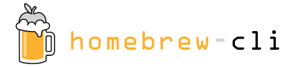

Simon's cli formulae for the Homebrew package manager.

  

## How do I install these formulae?

Just `brew tap simonmittag/cli` to add the tap, then `brew install <formula>` and you're done.

## More Documentation, Troubleshooting, Contributing, Security, Community, Donations, License and Sponsors

See these sections in [Homebrew/brew's README](https://github.com/Homebrew/brew#homebrew).
